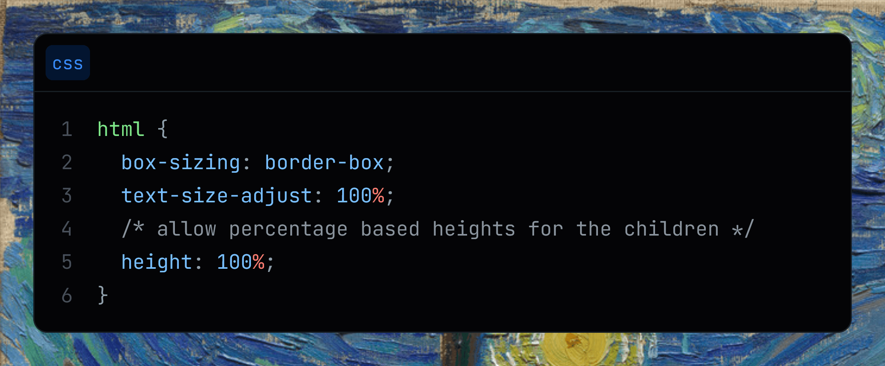
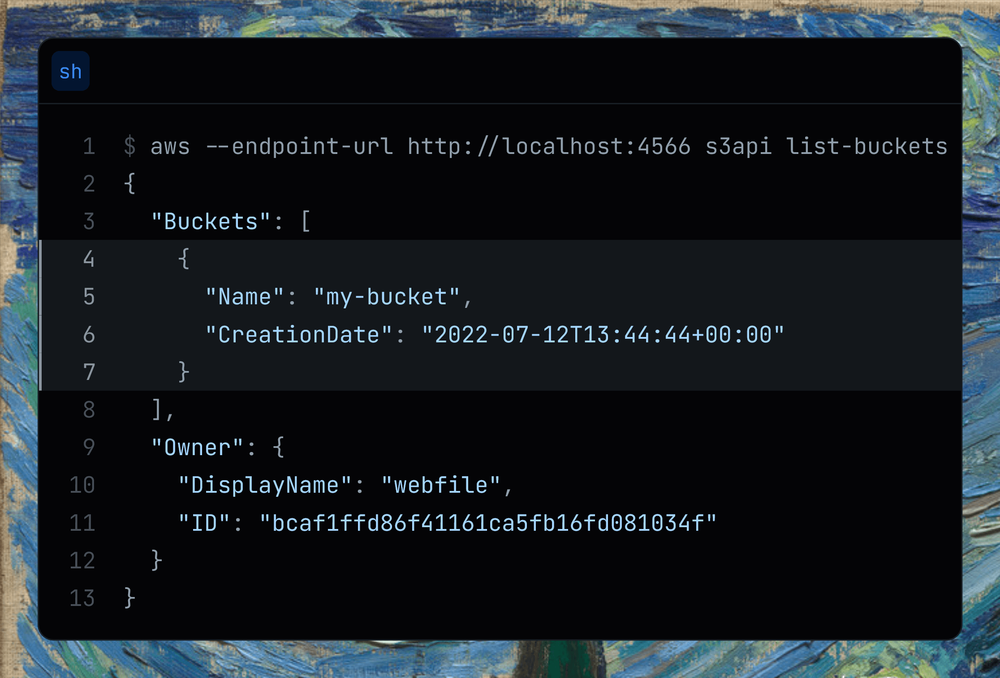
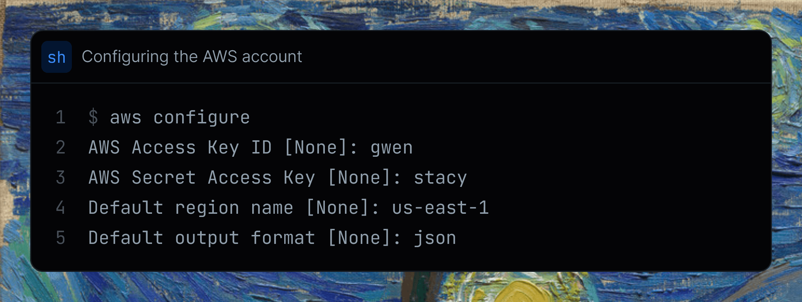

# remark-starry-night

[](https://www.npmjs.com/package/@microflash/remark-starry-night)
[](./LICENSE.md)

[remark](https://github.com/remarkjs/remark) plugin to highlight codeblocks with [Starry Night](https://github.com/wooorm/starry-night)

## Contents

- [Contents](#contents)
- [What's this?](#whats-this)
- [When should I use this?](#when-should-i-use-this)
- [Install](#install)
- [Use](#use)
- [API](#api)
	- [Options](#options)
	- [Themes](#themes)
	- [Decoration CSS](#decoration-css)
- [Examples](#examples)
	- [Example: single line codeblock](#example-single-line-codeblock)
	- [Example: line numbers for multiline codeblock](#example-line-numbers-for-multiline-codeblock)
	- [Example: show prompts](#example-show-prompts)
	- [Example: highlight lines](#example-highlight-lines)
	- [Example: add a caption to a codeblock](#example-add-a-caption-to-a-codeblock)
	- [Example: configure aliases](#example-configure-aliases)
- [Related](#related)
- [License](#license)

## What's this?

This package is a [unified](https://github.com/unifiedjs/unified) ([remark](https://github.com/remarkjs/remark)) plugin to highlight codeblocks with [Starry Night](https://github.com/wooorm/starry-night) in a markdown document. This results into syntax highlighting like what GitHub uses to highlight code.

## When should I use this?

This project is useful if you want to use the syntax highlighting powered by VS Code syntax highlighter engine, and themes similar to GitHub. It is also useful if you want to build your own syntax highlighting themes based on [CSS custom properties](https://developer.mozilla.org/en-US/docs/Web/CSS/Using_CSS_custom_properties).

The following additonal features are also available (all of them are optional):

- line numbers
- line highlights
- support for prompt
- captions and language information

## Install

This package is [ESM only](https://gist.github.com/sindresorhus/a39789f98801d908bbc7ff3ecc99d99c).

In Node.js (version 12.20+, 14.14+, or 16.0+), install with [npm](https://docs.npmjs.com/cli/install):

```sh
npm install @microflash/remark-starry-night
```

In Deno, with [esm.sh](https://esm.sh/):

```js
import remarkStarryNight from 'https://esm.sh/@microflash/remark-starry-night'
```

In browsers, with [esm.sh](https://esm.sh/):

```html
<script type="module">
  import remarkStarryNight from 'https://esm.sh/@microflash/remark-starry-night?bundle'
</script>
```

## Use

Say we have the following file `example.md`:

	```css
	html {
	  box-sizing: border-box;
	  text-size-adjust: 100%;
	  /* allow percentage based heights for the children */
	  height: 100%;
	}
	```

And our module `example.js` looks as follows:

```js
import { read } from 'to-vfile'
import { remark } from 'remark'
import remarkStarryNight from '@microflash/remark-starry-night'

main()

async function main() {
  const file = await remark()
    .use(remarkStarryNight)
    .process(await read('example.md'))

  console.log(String(file))
}
```

Running that with `node example.js` yields:

```html
<div class="highlight highlight-css">
  <div class="highlight-header">
    <div class="highlight-language">css</div>
  </div>
<pre><code tabindex="0"><span class="line"><span class="line-number" aria-hidden="true">1</span><span class="pl-ent">html</span> {</span>
<span class="line"><span class="line-number" aria-hidden="true">2</span>  <span class="pl-c1">box-sizing</span>: <span class="pl-c1">border-box</span>;</span>
<span class="line"><span class="line-number" aria-hidden="true">3</span>  <span class="pl-c1">text-size-adjust</span>: <span class="pl-c1">100</span><span class="pl-k">%</span>;</span>
<span class="line"><span class="line-number" aria-hidden="true">4</span>  <span class="pl-c">/* allow percentage based heights for the children */</span></span>
<span class="line"><span class="line-number" aria-hidden="true">5</span>  <span class="pl-c1">height</span>: <span class="pl-c1">100</span><span class="pl-k">%</span>;</span>
<span class="line"><span class="line-number" aria-hidden="true">6</span>}</span></code></pre>
</div>
```



## API

The default export is `remarkStarryNight`.

### Options

The following options are available. All of them are optional.

- `disableDecorations` (default: `false`): flag to turn off additional features such as line numbers, line highlighting, etc.
- `showLanguage` (default: `true`): displays the language token if enabled
- `showLineNumbers` (default: `true`): displays the line numbers for multiline codeblocks if enabled
- `highlightLines` (default: `true`): highlights lines based on additional metadata provided in a codeblock
- `showCaption` (default: `true`): displays a caption if provided in a codeblock
- `aliases`: an object to alias languages to force syntax highlighting. By default, unknown languages are highlighted as plain text.

### Themes

Check out the [available themes on Starry Night repository](https://github.com/wooorm/starry-night#css=).

### Decoration CSS

Additional decorations require some more styling. You can use [index.css](./index.css) alongwith the themes to style the decorations. Make sure that you define the following CSS properties in the [index.css](./index.css).

```css
:root {
  --color-prettylights-decoration-bg: ;
  --color-prettylights-decoration-border-radius: ;
  --color-prettylights-decoration-border-color: ;
  --color-prettylights-decoration-language-bg: ;
  --color-prettylights-decoration-linenumber-color: ;
  --color-prettylights-decoration-highlighted-linenumber-color: ;
  --color-prettylights-decoration-prompt-color: ;
  --color-prettylights-decoration-focussed-line-bg: ;
  --color-prettylights-decoration-highlighted-line-bg: ;
  --color-prettylights-decoration-highlighted-line-border-color: ;
}
```

## Examples

### Example: single line codeblock

	```sh
	docker ps -a
	```

The above codeblock will yield:

```html
<div class="highlight highlight-shell">
  <div class="highlight-header">
    <div class="highlight-language">sh</div>
  </div>
<pre><code tabindex="0"><span class="line line-standalone">docker ps -a</span></code></pre>
</div>
```


### Example: line numbers for multiline codeblock

	```css
	* {
	  display: revert;
	}

	```

The above codeblock will yield:

```html
<div class="highlight highlight-css">
  <div class="highlight-header">
    <div class="highlight-language">css</div>
  </div>
<pre><code tabindex="0"><span class="line"><span class="line-number" aria-hidden="true">1</span><span class="pl-ent">*</span> {</span>
<span class="line"><span class="line-number" aria-hidden="true">2</span>  <span class="pl-c1">display</span>: <span class="pl-c1">revert</span>;</span>
<span class="line"><span class="line-number" aria-hidden="true">3</span>}</span></code></pre>
</div>
```


Line numbers are automatically padded to ensure that the lines are properly aligned.

### Example: show prompts

Sometimes you may want to show a prompt while displaying a command-line instruction. Prompts on multiple lines can be specified as follows.

	```sh prompt='1,3'
	curl localhost:8080/actuator/health
	{"status":"UP"}
	curl localhost:8080/greeter?name=Anya
	Hello, Anya!
	```

The above codeblock will yield:

```html
<div class="highlight highlight-shell">
  <div class="highlight-header">
    <div class="highlight-language">sh</div>
  </div>
<pre><code tabindex="0"><span class="line"><span class="line-number" aria-hidden="true">1</span><span class="line-prompt" aria-hidden="true">$</span>curl localhost:8080/actuator/health</span>
<span class="line"><span class="line-number" aria-hidden="true">2</span>{<span class="pl-s"><span class="pl-pds">"</span>status<span class="pl-pds">"</span></span>:<span class="pl-s"><span class="pl-pds">"</span>UP<span class="pl-pds">"</span></span>}</span>
<span class="line"><span class="line-number" aria-hidden="true">3</span><span class="line-prompt" aria-hidden="true">$</span>curl localhost:8080/greeter<span class="pl-k">?</span>name=Anya</span>
<span class="line"><span class="line-number" aria-hidden="true">4</span>Hello, Anya<span class="pl-k">!</span></span></code></pre>
</div>
```


[index.css](./index.css) disables user-selection of prompts to make sure that when a user copies the content of a codeblock, the prompt is not copied.

### Example: highlight lines

You can highlight multiple lines by specifying the line numbers (or even, range of line numbers) between curly braces in the codeblock metadata.

	```sh {4-7} prompt='1'
	aws --endpoint-url http://localhost:4566 s3api list-buckets
	{
	  "Buckets": [
	    {
	      "Name": "my-bucket",
	      "CreationDate": "2022-07-12T13:44:44+00:00"
	    }
	  ],
	  "Owner": {
	    "DisplayName": "webfile",
	    "ID": "bcaf1ffd86f41161ca5fb16fd081034f"
	  }
	}
	```

The above codeblock will yield:

```html
<div class="highlight highlight-shell">
  <div class="highlight-header">
    <div class="highlight-language">sh</div>
  </div>
<pre><code tabindex="0"><span class="line"><span class="line-number" aria-hidden="true"> 1</span><span class="line-prompt" aria-hidden="true">$</span>aws --endpoint-url http://localhost:4566 s3api list-buckets</span>
<span class="line"><span class="line-number" aria-hidden="true"> 2</span>{</span>
<span class="line"><span class="line-number" aria-hidden="true"> 3</span>  <span class="pl-s"><span class="pl-pds">"</span>Buckets<span class="pl-pds">"</span></span>: [</span>
<span class="line line-highlighted"><span class="line-number" aria-hidden="true"> 4</span>    {</span>
<span class="line line-highlighted"><span class="line-number" aria-hidden="true"> 5</span>      <span class="pl-s"><span class="pl-pds">"</span>Name<span class="pl-pds">"</span></span>: <span class="pl-s"><span class="pl-pds">"</span>my-bucket<span class="pl-pds">"</span></span>,</span>
<span class="line line-highlighted"><span class="line-number" aria-hidden="true"> 6</span>      <span class="pl-s"><span class="pl-pds">"</span>CreationDate<span class="pl-pds">"</span></span>: <span class="pl-s"><span class="pl-pds">"</span>2022-07-12T13:44:44+00:00<span class="pl-pds">"</span></span></span>
<span class="line line-highlighted"><span class="line-number" aria-hidden="true"> 7</span>    }</span>
<span class="line"><span class="line-number" aria-hidden="true"> 8</span>  ],</span>
<span class="line"><span class="line-number" aria-hidden="true"> 9</span>  <span class="pl-s"><span class="pl-pds">"</span>Owner<span class="pl-pds">"</span></span>: {</span>
<span class="line"><span class="line-number" aria-hidden="true">10</span>    <span class="pl-s"><span class="pl-pds">"</span>DisplayName<span class="pl-pds">"</span></span>: <span class="pl-s"><span class="pl-pds">"</span>webfile<span class="pl-pds">"</span></span>,</span>
<span class="line"><span class="line-number" aria-hidden="true">11</span>    <span class="pl-s"><span class="pl-pds">"</span>ID<span class="pl-pds">"</span></span>: <span class="pl-s"><span class="pl-pds">"</span>bcaf1ffd86f41161ca5fb16fd081034f<span class="pl-pds">"</span></span></span>
<span class="line"><span class="line-number" aria-hidden="true">12</span>  }</span>
<span class="line"><span class="line-number" aria-hidden="true">13</span>}</span></code></pre>
</div>
```



Refer to the documentation of [fenceparser](https://github.com/Microflash/fenceparser) to learn about the additional ways in which you can specify the information about highlighted lines.

### Example: add a caption to a codeblock

Captions are useful to describe the context of a piece of code.

	```sh caption='Configuring the AWS account' prompt='1'
	aws configure
	AWS Access Key ID [None]: gwen
	AWS Secret Access Key [None]: stacy
	Default region name [None]: us-east-1
	Default output format [None]: json
	```

The above codeblock will yield:

```html
<div class="highlight highlight-shell">
  <div class="highlight-header">
    <div class="highlight-language">sh</div>
    <div class="highlight-caption">Configuring the AWS account</div>
  </div>
<pre><code tabindex="0"><span class="line"><span class="line-number" aria-hidden="true">1</span><span class="line-prompt" aria-hidden="true">$</span>aws configure</span>
<span class="line"><span class="line-number" aria-hidden="true">2</span>AWS Access Key ID [None]: gwen</span>
<span class="line"><span class="line-number" aria-hidden="true">3</span>AWS Secret Access Key [None]: stacy</span>
<span class="line"><span class="line-number" aria-hidden="true">4</span>Default region name [None]: us-east-1</span>
<span class="line"><span class="line-number" aria-hidden="true">5</span>Default output format [None]: json</span></code></pre>
</div>
```



### Example: configure aliases

Although Starry Night [supports](https://github.com/wooorm/starry-night#languages=) a huge number of languages, it is not all encompassing. In such cases, you can configure aliases to force syntax highlighting a codeblock containing code in a language not yet supported by Starry Night.

Say we have the following file `example.md`:

	```conf
	server {
	  listen 4200;
	  
	  gzip on;
	  
	  root /usr/share/nginx/html;
	  
	  location / {
	    index index.html index.htm;
	    try_files $uri $uri/ /index.html =404;
	  }
	}
	```

You can alias `conf` to `ini` as follows with `example.js`:

```js
import { read } from 'to-vfile'
import { remark } from 'remark'
import remarkStarryNight from '@microflash/remark-starry-night'

main()

async function main() {
  const file = await remark()
    .use(remarkStarryNight, {
      aliases: {
        conf: 'ini'
      }
    })
    .process(await read('example.md'))

  console.log(String(file))
}
```

Running that with `node example.js` yields:


```html
<div class="highlight highlight-ini">
  <div class="highlight-header">
    <div class="highlight-language">conf</div>
  </div>
<pre><code tabindex="0"><span class="line"><span class="line-number" aria-hidden="true"> 1</span>server {</span>
<span class="line"><span class="line-number" aria-hidden="true"> 2</span>  listen 4200<span class="pl-c">;</span></span>
<span class="line"><span class="line-number" aria-hidden="true"> 3</span></span>
<span class="line"><span class="line-number" aria-hidden="true"> 4</span>  gzip on<span class="pl-c">;</span></span>
<span class="line"><span class="line-number" aria-hidden="true"> 5</span>  </span>
<span class="line"><span class="line-number" aria-hidden="true"> 6</span>  root /usr/share/nginx/html<span class="pl-c">;</span></span>
<span class="line"><span class="line-number" aria-hidden="true"> 7</span>  </span>
<span class="line"><span class="line-number" aria-hidden="true"> 8</span>  location / {</span>
<span class="line"><span class="line-number" aria-hidden="true"> 9</span>    index index.html index.htm<span class="pl-c">;</span></span>
<span class="line"><span class="line-number" aria-hidden="true">10</span>    try_files $uri $uri/ /<span class="pl-k">index.html</span> =404<span class="pl-c">;</span></span>
<span class="line"><span class="line-number" aria-hidden="true">11</span>  }</span>
<span class="line"><span class="line-number" aria-hidden="true">12</span>}</span></code></pre>
</div>
```


## Related

- [`remark-highlight.js`](https://github.com/remarkjs/remark-highlight.js) &mdash; highlight code blocks in markdown files using [highlight.js](https://github.com/isagalaev/highlight.js)
- [`remark-prism`](https://github.com/sergioramos/remark-prism) &mdash; highlight code blocks in markdown files using [Prism](https://prismjs.com/)
- [`remark-shiki-twoslash`](https://github.com/shikijs/twoslash/tree/main/packages/remark-shiki-twoslash) &mdash; highlight code blocks in markdown files using [Shiki](https://github.com/shikijs/shiki)
- [`remark-tree-sitter`](https://github.com/samlanning/remark-tree-sitter) &mdash; highlight code blocks in markdown files using [Tree-sitter](https://tree-sitter.github.io/tree-sitter/)

## License

[MIT](./LICENSE.md)
